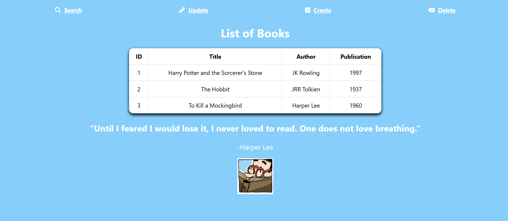

# **Library Management System**

This Spring Boot application provides a RESTful API and a Thymeleaf-powered frontend for managing a library. Users can Create, Read, Update, and Delete (CRUD) book records, with all changes reflected in a MySQL database.

**Frontend:** (Thymeleaf + JavaScript)
- Dynamic Book Management UI: Users can view, search, add, update, and delete books through a web interface.
- Interactive Search: Allows users to search for books by ID and display the results dynamically.
- JavaScript API Integration: The frontend uses fetch API for POST, PUT, and DELETE operations, enabling seamless communication with the backend.
  
**Backend:** (Spring Boot REST API)

MVC Architecture with Controller-Service-Repository Pattern

The application follows the Controller-Service-Repository pattern for a clean and maintainable structure:

- Controller Layer: Handles incoming HTTP requests and maps them to the appropriate service methods.
- Service Layer: Implements business logic and interacts with the repository.
- Repository Layer: Communicates directly with the database using Spring Data JPA.

**PageController:** (Handles Thymeleaf Views)
- Manages web pages users interact with.
- Retrieves all books and displays them in a table format.
- Allows searching for books via a simple ID-based lookup.
  
**LibraryController:** (Handles API Requests)
- Provides a RESTful API for interacting with the book data.
- Implements full CRUD functionality:
- Retrieve All Books: GET /api/books → Returns a JSON list of all books.
- Retrieve a Specific Book: GET /api/books/{id} → Returns a book’s details if found.
- Create a New Book: POST /api/books/create → Accepts book data (title, author, publication year) and adds it to the database.
- Update an Existing Book: PUT /api/books/{id} → Updates book details based on provided ID.
- Delete a Book: DELETE /api/books/delete/{id} → Removes the book from the database.
  
**Tech Stack**
- Java + Spring Boot (Spring Web, Spring Data JPA, Hibernate)
- MySQL (Database for persistent book storage)
- Thymeleaf (Server-side rendering for the UI)
- JavaScript (Fetch API) (Handles dynamic API interactions)
- Maven (Build and dependency management)
  
**Current Development**
- Styling using CSS
- Adding comments and documentation for better code clarity.

**Setup Instructions:**
1. Clone Repository
2. Configure Database Connection
3. Build and run the app using Maven
   

